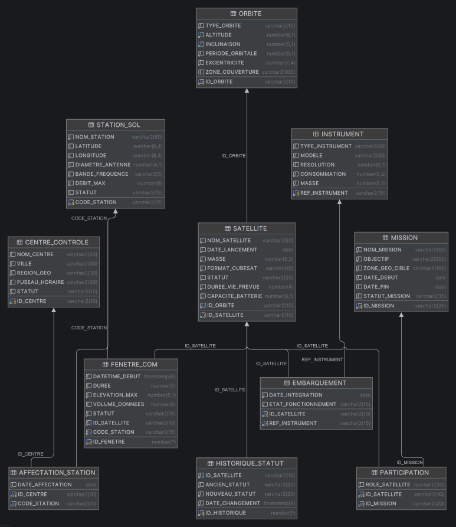

# Phase 1


## Dictionnaire des données

### Table ORBITE

| Attribut | Type Oracle | Obligatoire | Unique | Contraintes / Remarques | Catégorie |
|---|---|---|---|---|---|
| id_orbite | VARCHAR2(20) | OUI | OUI | PK — Code alphanumérique (ex : ORB-001) | Structure (PK) |
| type_orbite | VARCHAR2(10) | OUI | NON | CHECK IN ('SSO', 'LEO', 'MEO', 'GEO') | Contrainte (CHECK) |
| altitude_km | NUMBER(6,1) | OUI | NON | Altitude en km — partie de l'unicité composée | Structure (UNIQUE) |
| inclinaison_deg | NUMBER(5,2) | OUI | NON | Inclinaison en degrés — partie de l'unicité composée | Structure (UNIQUE) |
| periode_minutes | NUMBER(6,2) | OUI | NON | Période orbitale en minutes | Contrainte (NOT NULL) |
| couverture_geo | VARCHAR2(100) | OUI | NON | Description de la zone de couverture géographique | Contrainte (NOT NULL) |

> **RG-O02** : La combinaison `(altitude_km, inclinaison_deg)` doit être UNIQUE.


### Table SATELLITE

| Attribut | Type Oracle | Obligatoire | Unique | Contraintes / Remarques | Catégorie |
|---|---|---|---|---|---|
| id_satellite | VARCHAR2(20) | OUI | OUI | PK — Code immuable (ex : SAT-001) | Structure (PK) |
| nom_satellite | VARCHAR2(100) | OUI | NON | Nom commercial ou opérationnel | Contrainte (NOT NULL) |
| format_cubesat | VARCHAR2(5) | OUI | NON | CHECK IN ('1U', '3U', '6U', '12U') | Contrainte (CHECK) |
| statut_actuel | VARCHAR2(20) | OUI | NON | CHECK IN ('Opérationnel', 'En veille', 'Défaillant', 'Désorbité') | Contrainte (CHECK) |
| capacite_batterie_wh | NUMBER(8,2) | OUI | NON | Capacité de la batterie embarquée en Wh | Contrainte (NOT NULL) |
| duree_vie_estimee_j | NUMBER(6) | OUI | NON | Durée de vie estimée en jours | Contrainte (NOT NULL) |
| date_lancement | DATE | OUI | NON | Date de mise en orbite | Contrainte (NOT NULL) |
| id_orbite | VARCHAR2(20) | OUI | NON | FK → ORBITE.id_orbite | Structure (FK) |

> **RG-S06** : Un satellite avec `statut_actuel = 'Désorbité'` ne peut plus être associé à une fenêtre de communication ni à une mission → implémenté par triggers T1 et T4.

---

### Table INSTRUMENT

| Attribut | Type Oracle | Obligatoire | Unique | Contraintes / Remarques | Catégorie |
|---|---|---|---|---|---|
| id_instrument | VARCHAR2(20) | OUI | OUI | PK — Code alphanumérique (ex : INS-001) | Structure (PK) |
| nom_instrument | VARCHAR2(100) | OUI | NON | Nom de l'instrument scientifique | Contrainte (NOT NULL) |
| type_instrument | VARCHAR2(50) | OUI | NON | CHECK IN ('Capteur', 'Caméra', 'AIS', 'Radar', 'Autre') | Contrainte (CHECK) |
| resolution_m | NUMBER(8,3) | NON | NON | Résolution en mètres — NULL pour les capteurs non optiques (ex : AIS) | Contrainte (nullable) |
| description | VARCHAR2(255) | NON | NON | Description fonctionnelle de l'instrument | — |

---

### Table EMBARQUEMENT *(association porteuse)*

| Attribut | Type Oracle | Obligatoire | Unique | Contraintes / Remarques | Catégorie |
|---|---|---|---|---|---|
| id_satellite | VARCHAR2(20) | OUI | NON | PK composée + FK → SATELLITE.id_satellite | Structure (PK/FK) |
| id_instrument | VARCHAR2(20) | OUI | NON | PK composée + FK → INSTRUMENT.id_instrument | Structure (PK/FK) |
| date_integration | DATE | OUI | NON | Date de montage de l'instrument sur le satellite | Contrainte (NOT NULL) |
| etat_fonctionnement | VARCHAR2(20) | OUI | NON | CHECK IN ('Actif', 'Inactif', 'En panne') | Contrainte (CHECK) |

> **RG-S04** : Un instrument peut être embarqué sur plusieurs satellites (à des dates différentes) ; la PK composée `(id_satellite, id_instrument)` garantit l'unicité de la paire.

---

### Table CENTRE_CONTROLE

| Attribut | Type Oracle | Obligatoire | Unique | Contraintes / Remarques | Catégorie |
|---|---|---|---|---|---|
| id_centre | VARCHAR2(20) | OUI | OUI | PK — Code alphanumérique (ex : CTR-PAR) | Structure (PK) |
| nom_centre | VARCHAR2(100) | OUI | NON | Nom du centre (ex : Paris Opérations) | Contrainte (NOT NULL) |
| ville | VARCHAR2(50) | OUI | NON | Ville d'implantation (Paris, Singapour, Houston) | Contrainte (NOT NULL) |
| pays | VARCHAR2(50) | OUI | NON | Pays d'implantation | Contrainte (NOT NULL) |
| fuseau_horaire | VARCHAR2(10) | OUI | NON | Fuseau UTC (ex : UTC+1, UTC+8) | Contrainte (NOT NULL) |

---

### Table STATION_SOL

| Attribut | Type Oracle | Obligatoire | Unique | Contraintes / Remarques | Catégorie |
|---|---|---|---|---|---|
| code_station | VARCHAR2(20) | OUI | OUI | PK — Code alphanumérique (ex : GS-TLS-01) | Structure (PK) |
| nom_station | VARCHAR2(100) | OUI | NON | Nom de la station d'antenne | Contrainte (NOT NULL) |
| latitude | NUMBER(8,5) | OUI | NON | Latitude géographique en degrés décimaux | Contrainte (NOT NULL) |
| longitude | NUMBER(8,5) | OUI | NON | Longitude géographique en degrés décimaux | Contrainte (NOT NULL) |
| statut_station | VARCHAR2(20) | OUI | NON | CHECK IN ('Active', 'En maintenance', 'Hors service') | Contrainte (CHECK) |
| debit_maximal_mbps | NUMBER(8,2) | OUI | NON | Débit maximal de la liaison montante/descendante en Mbps | Contrainte (NOT NULL) |

> **RG-G03** : Une fenêtre de communication ne peut pas être planifiée si la station est en `'En maintenance'` → implémenté par trigger T1.

---

### Table AFFECTATION_STATION

| Attribut | Type Oracle | Obligatoire | Unique | Contraintes / Remarques | Catégorie |
|---|---|---|---|---|---|
| id_centre | VARCHAR2(20) | OUI | NON | PK composée + FK → CENTRE_CONTROLE.id_centre | Structure (PK/FK) |
| code_station | VARCHAR2(20) | OUI | NON | PK composée + FK → STATION_SOL.code_station | Structure (PK/FK) |
| date_affectation | DATE | OUI | NON | Date de rattachement de la station au centre | Contrainte (NOT NULL) |

---

### Table MISSION

| Attribut | Type Oracle | Obligatoire | Unique | Contraintes / Remarques | Catégorie |
|---|---|---|---|---|---|
| id_mission | VARCHAR2(20) | OUI | OUI | PK — Code alphanumérique (ex : MSN-ARC-2023) | Structure (PK) |
| nom_mission | VARCHAR2(100) | OUI | NON | Intitulé de la mission scientifique | Contrainte (NOT NULL) |
| objectif | VARCHAR2(255) | OUI | NON | Description de l'objectif scientifique | Contrainte (NOT NULL) |
| zone_cible | VARCHAR2(100) | OUI | NON | Zone géographique observée (ex : Arctique) | Contrainte (NOT NULL) |
| statut_mission | VARCHAR2(20) | OUI | NON | CHECK IN ('Active', 'Planifiée', 'Terminée') | Contrainte (CHECK) |
| date_debut | DATE | OUI | NON | Date de début de la mission | Contrainte (NOT NULL) |
| date_fin | DATE | NON | NON | Date de fin — **nullable** (mission en cours) | Contrainte (nullable) |

> **RG-M01** : `date_fin` est le seul attribut nullable de MISSION.  
> **RG-M04** : L'ajout d'un satellite à une mission `'Terminée'` est bloqué → implémenté par trigger T4.

---

### Table FENETRE_COM

| Attribut | Type Oracle | Obligatoire | Unique | Contraintes / Remarques | Catégorie |
|---|---|---|---|---|---|
| id_fenetre | VARCHAR2(20) | OUI | OUI | PK — Code alphanumérique (ex : FCM-001) | Structure (PK) |
| id_satellite | VARCHAR2(20) | OUI | NON | FK → SATELLITE.id_satellite | Structure (FK) |
| code_station | VARCHAR2(20) | OUI | NON | FK → STATION_SOL.code_station | Structure (FK) |
| datetime_debut | TIMESTAMP | OUI | NON | Date et heure de début du créneau de passage | Contrainte (NOT NULL) |
| duree_secondes | NUMBER(4) | OUI | NON | Durée en secondes — CHECK BETWEEN 1 AND 900 | Contrainte (CHECK) |
| statut_fenetre | VARCHAR2(20) | OUI | NON | CHECK IN ('Planifiée', 'Réalisée', 'Annulée') | Contrainte (CHECK) |
| volume_donnees_mb | NUMBER(10,2) | NON | NON | Volume téléchargé en Mo — NULL si statut ≠ 'Réalisée' | Mécanique (Trigger T3) |

> **RG-F02** : Pas de chevauchement temporel pour un même satellite → trigger T2.  
> **RG-F03** : Pas de chevauchement temporel pour une même station → trigger T2.  
> **RG-F04** : `duree_secondes` doit être compris entre 1 et 900 secondes → contrainte CHECK.  
> **RG-F05** : `volume_donnees_mb` doit être NULL si `statut_fenetre ≠ 'Réalisée'` → trigger T3.

---

### Table PARTICIPATION *(association porteuse)*

| Attribut | Type Oracle | Obligatoire | Unique | Contraintes / Remarques | Catégorie |
|---|---|---|---|---|---|
| id_satellite | VARCHAR2(20) | OUI | NON | PK composée + FK → SATELLITE.id_satellite | Structure (PK/FK) |
| id_mission | VARCHAR2(20) | OUI | NON | PK composée + FK → MISSION.id_mission | Structure (PK/FK) |
| role_satellite | VARCHAR2(100) | OUI | NON | Rôle du satellite dans la mission (ex : "Satellite de relais") | Contrainte (NOT NULL) |

> **RG-M03** : Un satellite peut participer à plusieurs missions avec des rôles différents ; la PK composée `(id_satellite, id_mission)` garantit l'unicité.

---

### Table HISTORIQUE_STATUT *(table technique pour trigger T5)*

| Attribut | Type Oracle | Obligatoire | Unique | Contraintes / Remarques | Catégorie |
|---|---|---|---|---|---|
| id_historique | NUMBER | OUI | OUI | PK — Générée automatiquement (séquence ou IDENTITY) | Structure (PK) |
| id_satellite | VARCHAR2(20) | OUI | NON | FK → SATELLITE.id_satellite | Structure (FK) |
| ancien_statut | VARCHAR2(20) | OUI | NON | Statut avant modification | Contrainte (NOT NULL) |
| nouveau_statut | VARCHAR2(20) | OUI | NON | Statut après modification | Contrainte (NOT NULL) |
| date_changement | TIMESTAMP | OUI | NON | Horodatage précis du changement — valeur par défaut : SYSTIMESTAMP | Contrainte (NOT NULL) |
| motif | VARCHAR2(255) | NON | NON | Commentaire libre sur la raison du changement de statut | — |

> Alimentée automatiquement par le trigger **T5 — trg_historique_statut** (AFTER UPDATE OF statut ON SATELLITE).

---

### Récapitulatif de la classification des règles de gestion

| Catégorie de garantie | Règles NanoOrbit | Mécanisme Oracle |
|---|---|---|
| **Structure relationnelle** | PK de chaque table (RG-S01), unicité altitude+inclinaison (RG-O02), PK composées EMBARQUEMENT et PARTICIPATION | `PRIMARY KEY`, `UNIQUE`, `FOREIGN KEY` |
| **Contrainte simple** | Durée fenêtre 1–900 s (RG-F04), valeurs de statut et état (dictionnaire), `date_fin` nullable (RG-M01), `volume_donnees_mb` nullable (RG-F05) | `CHECK`, `NOT NULL`, type déclaratif |
| **Mécanisme procédural** | Chevauchement de fenêtres (RG-F02/F03), satellite désorbité bloqué (RG-S06), station en maintenance bloquée (RG-G03), mission terminée bloquée (RG-M04), volume forcé à NULL (RG-F05), traçabilité des statuts (RG-S06) | Triggers T1 à T5 |


## MCD 




## MLD

### Modèle Logique de Données

#### Tables et leurs attributs

**ORBITE** (<u>ID_ORBITE</u>, TYPE_ORBITE, ALTITUDE, INCLINAISON, PERIODE_ORBITALE, EXCENTRICITE, ZONE_COUVERTURE)

**SATELLITE** (<u>ID_SATELLITE</u>, NOM_SATELLITE, DATE_LANCEMENT, MASSE, FORMAT_CUBESAT, STATUT, DUREE_VIE_PREVUE, CAPACITE_BATTERIE, #ID_ORBITE)

**INSTRUMENT** (<u>REF_INSTRUMENT</u>, TYPE_INSTRUMENT, MODELE, RESOLUTION, CONSOMMATION, MASSE)

**EMBARQUEMENT** (<u>#ID_SATELLITE</u>, <u>#REF_INSTRUMENT</u>, DATE_INTEGRATION, ETAT_FONCTIONNEMENT)

**MISSION** (<u>ID_MISSION</u>, NOM_MISSION, OBJECTIF, ZONE_GEO_CIBLE, DATE_DEBUT, DATE_FIN, STATUT_MISSION)

**PARTICIPATION** (<u>#ID_SATELLITE</u>, <u>#ID_MISSION</u>, ROLE_SATELLITE)

**STATION_SOL** (<u>CODE_STATION</u>, NOM_STATION, LATITUDE, LONGITUDE, DIAMETRE_ANTENNE, BANDE_FREQUENCE, DEBIT_MAX, STATUT)

**CENTRE_CONTROLE** (<u>ID_CENTRE</u>, NOM_CENTRE, VILLE, REGION_GEO, FUSEAU_HORAIRE, STATUT)

**AFFECTATION_STATION** (<u>#ID_CENTRE</u>, <u>#CODE_STATION</u>, DATE_AFFECTATION)

**FENETRE_COM** (<u>ID_FENETRE</u>, DATETIME_DEBUT, DUREE, ELEVATION_MAX, VOLUME_DONNEES, STATUT, #ID_SATELLITE, #CODE_STATION)

**HISTORIQUE_STATUT** (<u>ID_HISTORIQUE</u>, ANCIEN_STATUT, NOUVEAU_STATUT, DATE_CHANGEMENT, #ID_SATELLITE)

---

#### Légende

| Notation | Signification |
|---|---|
| <u>attribut</u> | Clé primaire |
| #attribut | Clé étrangère |
| (clé1, clé2) soulignées | Clé primaire composite |

---

#### Relations et cardinalités

- **SATELLITE** → **ORBITE** : un satellite est placé sur une orbite (`ID_ORBITE` FK dans SATELLITE)
- **EMBARQUEMENT** : table d'association entre **SATELLITE** et **INSTRUMENT** (clé primaire composite `ID_SATELLITE` + `REF_INSTRUMENT`)
- **PARTICIPATION** : table d'association entre **SATELLITE** et **MISSION** (clé primaire composite `ID_SATELLITE` + `ID_MISSION`)
- **AFFECTATION_STATION** : table d'association entre **CENTRE_CONTROLE** et **STATION_SOL**
- **FENETRE_COM** : relie une **STATION_SOL** à un **SATELLITE** pour chaque fenêtre de communication
- **HISTORIQUE_STATUT** : enregistre les changements de statut d'un **SATELLITE**


# Note de modélisation

## Question 1 
Quelles tables du MLD sont strictement locales à un centre de contrôle ? Justifiez en
expliquant pourquoi ces données n'ont pas vocation à être partagées entre centres

**FENETRE_COM**
Chaque fenêtre de communication est planifiée par le centre qui supervise la station sol concernée :

CTR-001 (Paris) gère les fenêtres vers GS-TLS-01 et GS-KIR-01
CTR-002 (Houston) gère les fenêtres vers GS-SGP-01

Ces données sont purement opérationnelles et temps-réel : un centre n'a ni besoin de consulter les fenêtres planifiées par un autre centre.

**HISTORIQUE_STATUT**
Cette table est alimentée automatiquement par le trigger T5 lors de chaque UPDATE de statut sur SATELLITE. Elle constitue un journal d'audit local à chaque centre. Partager cet historique impliquerait une synchronisation continue entre centres.

## Question 2 
Quelles tables doivent être globales (accessibles depuis tous les centres) ? Quels
mécanismes de synchronisation proposez-vous (réplication, partage en lecture seule, etc.)
?

| Table | Raison |
|---|---|
| `ORBITE` | Plan orbital commun à tous les satellites — référence physique immuable |
| `SATELLITE` | Statut et caractéristiques des satellites — tous les centres pilotent les mêmes engins |
| `INSTRUMENT` | Catalogue d'instruments — référence technique partagée |
| `EMBARQUEMENT` | Lie satellites et instruments — nécessaire pour planifier les missions |
| `CENTRE_CONTROLE` | Chaque centre doit connaître les autres pour la coordination |
| `STATION_SOL` | Une station peut être consultée par plusieurs centres |
| `MISSION` | Une mission mobilise des satellites gérés par des centres différents |
| `PARTICIPATION` | Définit quels satellites participent à quelle mission — coordination inter-centres obligatoire |


## Question 3
Comment le centre de Singapour peut-il continuer à planifier des fenêtres de
communication si le serveur central est indisponible ? Proposez une architecture de
fragmentation horizontale ou verticale adaptée

FENETRE_COM est une table locale à chaque centre. Mais pour planifier une fenêtre, le centre de Singapour a besoin de données globales, statut du satellite (SATELLITE), statut de la station (STATION_SOL) et missions actives (MISSION). Si le serveur central est indisponible, ces lectures échouent et la planification est bloquée

La solution serait de faire en sorte que chaque centre dispose d'un nœud local autonome contenant :

- Son fragment local de FENETRE_COM (les fenêtres qui le concernent uniquement)
- Une réplique en lecture seule des tables globales nécessaires à la planification

## Question 4
Quels risques de cohérence identifiez-vous dans ce système multi-sites ? Citez deux
scénarios concrets (ex : mise à jour simultanée du statut d'un satellite depuis deux
centres)


### Scénario 1 — Mise à jour simultanée du statut d'un satellite

**Contexte** : SAT-003 est `Opérationnel`. Une anomalie thermique est détectée simultanément par Paris et Houston, qui tentent chacun de mettre à jour le statut.

```sql
-- t=0 Paris
UPDATE SATELLITE SET statut = 'En veille' WHERE id_satellite = 'SAT-003';

-- t=0 Houston
UPDATE SATELLITE SET statut = 'Désorbité' WHERE id_satellite = 'SAT-003';
```

**Risque** : sans verrou distribué, les deux transactions s'exécutent en parallèle. Le statut le plus critique (`Désorbité`) peut être écrasé par `En veille` laissant le système dans un état incohérent et potentiellement dangereux.

**Conséquence concrète** : le trigger T5 s'exécute deux fois localement produisant deux entrées contradictoires dans `HISTORIQUE_STATUT`. La traçabilité est corrompue.

**Mitigation** : protocole **2PC (Two-Phase Commit)** sur les écritures de `SATELLITE`, avec un nœud coordinateur unique qui sérialise les mises à jour concurrentes.


### Scénario 2 — Planification d'une fenêtre sur un satellite entre-temps désorbité

**Contexte** : la réplique locale de Singapour indique SAT-003 `Opérationnel`. Entre le dernier rafraîchissement et maintenant, Paris a mis à jour le statut en `Désorbité`.

```sql
-- t=0 Paris
UPDATE SATELLITE SET statut = 'Désorbité' WHERE id_satellite = 'SAT-003';

-- t=5 Singapour (réplique locale non encore rafraîchie)
INSERT INTO FENETRE_COM (...) VALUES (..., 'SAT-003', ..., 'Planifiée');
-- trigger T1 lit 'Opérationnel' sur la réplique → laisse passer l'insertion
```

**Risque** : le trigger T1 s'appuie sur la réplique locale pour vérifier le statut du satellite. Il lit `Opérationnel` au lieu de `Désorbité` et laisse passer l'insertion, créant une fenêtre planifiée vers un satellite hors service.

**Conséquence concrète** : violation de la règle RGS06: une fenêtre de communication existe pour un satellite désorbité, ce que le système est censé interdire strictement.

**Mitigation** : pour toute insertion dans `FENETRE_COM`, forcer une **lecture du statut satellite directement sur le nœud maître**, quitte à introduire une latence réseau ponctuelle.


### Synthèse

| Scénario | Table impactée | Type de risque | Mitigation |
|---|---|---|---|
| Mise à jour simultanée de statut | `SATELLITE`, `HISTORIQUE_STATUT` | Conflit d'écriture concurrent | Two-Phase Commit + nœud coordinateur |
| Fenêtre sur satellite désorbité | `FENETRE_COM`, `SATELLITE` | Lecture sur réplique obsolète | Lecture maître obligatoire à l'insertion |


**Principe général** : ces deux scénarios illustrent le théorème CAP — en choisissant la **disponibilité** (Singapour peut écrire sans le serveur central), on sacrifie la **cohérence**. Le paramètre clé est le TTL de la réplique locale : plus il est court, plus la fenêtre d'incohérence se réduit, au prix d'un trafic réseau plus élevé.

