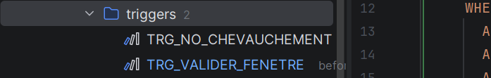

# Phase 2

## Script DDL complet


```sql
-- ============================================================
-- 1. ORBITE
-- ============================================================
CREATE TABLE ORBITE (
    id_orbite        VARCHAR2(10)    NOT NULL,
    type_orbite      VARCHAR2(10)    NOT NULL,   -- SSO, LEO
    altitude         NUMBER(6,1)     NOT NULL,   -- km
    inclinaison      NUMBER(5,1)     NOT NULL,   -- degrés
    periode_orbitale NUMBER(5,1)     NOT NULL,   -- minutes
    excentricite     NUMBER(7,4)     NOT NULL,
    zone_couverture  VARCHAR2(100),
    --
    CONSTRAINT pk_orbite        PRIMARY KEY (id_orbite),
    CONSTRAINT uq_orbite_alt_inc UNIQUE (altitude, inclinaison),
    CONSTRAINT ck_orbite_type   CHECK (type_orbite IN ('SSO','LEO','MEO','GEO'))
);

-- ============================================================
-- 2. SATELLITE
-- ============================================================
CREATE TABLE SATELLITE (
    id_satellite      VARCHAR2(10)    NOT NULL,
    nom_satellite     VARCHAR2(50)    NOT NULL,
    date_lancement    DATE            NOT NULL,
    masse             NUMBER(5,2)     NOT NULL,   -- kg
    format_cubesat    VARCHAR2(5)     NOT NULL,   -- 3U, 6U, 12U...
    statut            VARCHAR2(20)    NOT NULL,
    duree_vie_prevue  NUMBER(4)       NOT NULL,   -- mois
    capacite_batterie NUMBER(6,1)     NOT NULL,   -- Wh
    id_orbite         VARCHAR2(10)    NOT NULL,
    --
    CONSTRAINT pk_satellite     PRIMARY KEY (id_satellite),
    CONSTRAINT fk_sat_orbite    FOREIGN KEY (id_orbite)
                                    REFERENCES ORBITE(id_orbite),
    CONSTRAINT ck_sat_statut    CHECK (statut IN (
                                    'Opérationnel','En veille','Défaillant','Désorbité'))
);

-- ============================================================
-- 3. INSTRUMENT
-- ============================================================
CREATE TABLE INSTRUMENT (
    ref_instrument    VARCHAR2(15)    NOT NULL,
    type_instrument   VARCHAR2(30)    NOT NULL,
    modele            VARCHAR2(30)    NOT NULL,
    resolution        NUMBER(6,1),               -- NULL autorisé (ex: AIS)
    consommation      NUMBER(5,2)     NOT NULL,   -- W
    masse             NUMBER(5,2)     NOT NULL,   -- kg
    --
    CONSTRAINT pk_instrument    PRIMARY KEY (ref_instrument)
);

-- ============================================================
-- 4. EMBARQUEMENT  (PK composite)
-- ============================================================
CREATE TABLE EMBARQUEMENT (
    id_satellite         VARCHAR2(10)    NOT NULL,
    ref_instrument       VARCHAR2(15)    NOT NULL,
    date_integration     DATE            NOT NULL,
    etat_fonctionnement  VARCHAR2(15)    NOT NULL,
    --
    CONSTRAINT pk_embarquement  PRIMARY KEY (id_satellite, ref_instrument),
    CONSTRAINT fk_emb_satellite FOREIGN KEY (id_satellite)
                                    REFERENCES SATELLITE(id_satellite),
    CONSTRAINT fk_emb_instrument FOREIGN KEY (ref_instrument)
                                    REFERENCES INSTRUMENT(ref_instrument),
    CONSTRAINT ck_emb_etat      CHECK (etat_fonctionnement IN (
                                    'Nominal','Dégradé','Hors service'))
);

-- ============================================================
-- 5. CENTRE_CONTROLE
-- ============================================================
CREATE TABLE CENTRE_CONTROLE (
    id_centre       VARCHAR2(10)    NOT NULL,
    nom_centre      VARCHAR2(50)    NOT NULL,
    ville           VARCHAR2(30)    NOT NULL,
    region_geo      VARCHAR2(30)    NOT NULL,
    fuseau_horaire  VARCHAR2(30)    NOT NULL,
    statut          VARCHAR2(10)    NOT NULL,
    --
    CONSTRAINT pk_centre        PRIMARY KEY (id_centre),
    CONSTRAINT ck_centre_statut CHECK (statut IN ('Actif','Inactif'))
);

-- ============================================================
-- 6. STATION_SOL
-- ============================================================
CREATE TABLE STATION_SOL (
    code_station       VARCHAR2(15)    NOT NULL,
    nom_station        VARCHAR2(50)    NOT NULL,
    latitude           NUMBER(8,4)     NOT NULL,
    longitude          NUMBER(8,4)     NOT NULL,
    diametre_antenne   NUMBER(4,1)     NOT NULL,   -- m
    bande_frequence    VARCHAR2(5)     NOT NULL,   -- S, X, Ka...
    debit_max          NUMBER(6)       NOT NULL,   -- Mbps
    statut             VARCHAR2(15)    NOT NULL,
    --
    CONSTRAINT pk_station       PRIMARY KEY (code_station),
    CONSTRAINT ck_station_statut CHECK (statut IN ('Active','Maintenance','Inactive'))
);

-- ============================================================
-- 7. AFFECTATION_STATION  (PK composite)
-- ============================================================
CREATE TABLE AFFECTATION_STATION (
    id_centre         VARCHAR2(10)    NOT NULL,
    code_station      VARCHAR2(15)    NOT NULL,
    date_affectation  DATE            NOT NULL,
    --
    CONSTRAINT pk_affectation             PRIMARY KEY (id_centre, code_station),
    CONSTRAINT fk_aff_centre              FOREIGN KEY (id_centre)
                                              REFERENCES CENTRE_CONTROLE(id_centre),
    CONSTRAINT fk_aff_station             FOREIGN KEY (code_station)
                                              REFERENCES STATION_SOL(code_station)
);

-- ============================================================
-- 8. MISSION
-- ============================================================
CREATE TABLE MISSION (
    id_mission       VARCHAR2(20)    NOT NULL,
    nom_mission      VARCHAR2(50)    NOT NULL,
    objectif         VARCHAR2(200)   NOT NULL,
    zone_geo_cible   VARCHAR2(100)   NOT NULL,
    date_debut       DATE            NOT NULL,
    date_fin         DATE,
    statut_mission   VARCHAR2(15)    NOT NULL,
    --
    CONSTRAINT pk_mission           PRIMARY KEY (id_mission),
    CONSTRAINT ck_mission_statut    CHECK (statut_mission IN ('Active','Terminée')),
    CONSTRAINT ck_mission_dates     CHECK (date_fin IS NULL OR date_fin > date_debut)
);

-- ============================================================
-- 9. FENETRE_COM  (PK auto-incrémentée)
-- ============================================================
CREATE TABLE FENETRE_COM (
    id_fenetre       NUMBER          GENERATED ALWAYS AS IDENTITY
                                     (START WITH 1 INCREMENT BY 1),
    datetime_debut   TIMESTAMP       NOT NULL,
    duree            NUMBER(5)       NOT NULL,    -- secondes
    elevation_max    NUMBER(5,1)     NOT NULL,    -- degrés
    volume_donnees   NUMBER(8)       ,            -- MB — NULL si Planifiée (T3)
    statut           VARCHAR2(15)    NOT NULL,
    id_satellite     VARCHAR2(10)    NOT NULL,
    code_station     VARCHAR2(15)    NOT NULL,
    --
    CONSTRAINT pk_fenetre           PRIMARY KEY (id_fenetre),
    CONSTRAINT fk_fen_satellite     FOREIGN KEY (id_satellite)
                                        REFERENCES SATELLITE(id_satellite),
    CONSTRAINT fk_fen_station       FOREIGN KEY (code_station)
                                        REFERENCES STATION_SOL(code_station),
    CONSTRAINT ck_fen_statut        CHECK (statut IN ('Planifiée','Réalisée','Annulée')),
    CONSTRAINT ck_fen_duree         CHECK (duree BETWEEN 1 AND 900)
);

-- ============================================================
-- 10. PARTICIPATION  (PK composite)
-- ============================================================
CREATE TABLE PARTICIPATION (
    id_satellite    VARCHAR2(10)    NOT NULL,
    id_mission      VARCHAR2(20)    NOT NULL,
    role_satellite  VARCHAR2(30)    NOT NULL,
    --
    CONSTRAINT pk_participation     PRIMARY KEY (id_satellite, id_mission),
    CONSTRAINT fk_par_satellite     FOREIGN KEY (id_satellite)
                                        REFERENCES SATELLITE(id_satellite),
    CONSTRAINT fk_par_mission       FOREIGN KEY (id_mission)
                                        REFERENCES MISSION(id_mission)
);

-- ============================================================
-- 11. HISTORIQUE_STATUT  (alimentée par trigger T5 uniquement)
-- ============================================================
CREATE TABLE HISTORIQUE_STATUT (
    id_historique   NUMBER          GENERATED ALWAYS AS IDENTITY
                                    (START WITH 1 INCREMENT BY 1),
    id_satellite    VARCHAR2(10)    NOT NULL,
    ancien_statut   VARCHAR2(20)    NOT NULL,
    nouveau_statut  VARCHAR2(20)    NOT NULL,
    date_changement TIMESTAMP       DEFAULT SYSTIMESTAMP NOT NULL,
    --
    CONSTRAINT pk_historique        PRIMARY KEY (id_historique),
    CONSTRAINT fk_hist_satellite    FOREIGN KEY (id_satellite)
                                        REFERENCES SATELLITE(id_satellite)
);

```


## DML

```sql
INSERT INTO ORBITE (id_orbite, type_orbite, altitude, inclinaison, periode_orbitale, excentricite, zone_couverture)
VALUES ('ORB-001', 'SSO', 550, 97.6, 95.5, 0.0010, 'Polaire globale Europe / Arctique');
INSERT INTO ORBITE (id_orbite, type_orbite, altitude, inclinaison, periode_orbitale, excentricite, zone_couverture)
VALUES ('ORB-002', 'SSO', 700, 98.2, 98.8, 0.0008, 'Polaire globale haute latitude');
INSERT INTO ORBITE (id_orbite, type_orbite, altitude, inclinaison, periode_orbitale, excentricite, zone_couverture)
VALUES ('ORB-003', 'LEO', 400, 51.6, 92.6, 0.0020, 'Équatoriale zone tropicale');

-- 2. Table SATELLITE (5 lignes) [cite: 28, 29]
INSERT INTO SATELLITE (id_satellite, nom_satellite, date_lancement, masse, format_cubesat, statut, duree_vie_prevue, capacite_batterie, id_orbite)
VALUES ('SAT-001', 'NanoOrbit-Alpha', DATE '2022-03-15', 1.30, '3U', 'Opérationnel', 60, 20, 'ORB-001');
INSERT INTO SATELLITE (id_satellite, nom_satellite, date_lancement, masse, format_cubesat, statut, duree_vie_prevue, capacite_batterie, id_orbite)
VALUES ('SAT-002', 'NanoOrbit-Beta', DATE '2022-03-15', 1.30, '3U', 'Opérationnel', 60, 20, 'ORB-001');
INSERT INTO SATELLITE (id_satellite, nom_satellite, date_lancement, masse, format_cubesat, statut, duree_vie_prevue, capacite_batterie, id_orbite)
VALUES ('SAT-003', 'NanoOrbit-Gamma', DATE '2023-06-10', 2.00, '6U', 'Opérationnel', 84, 40, 'ORB-002');
INSERT INTO SATELLITE (id_satellite, nom_satellite, date_lancement, masse, format_cubesat, statut, duree_vie_prevue, capacite_batterie, id_orbite)
VALUES ('SAT-004', 'NanoOrbit-Delta', DATE '2023-06-10', 2.00, '6U', 'En veille', 84, 40, 'ORB-002');
INSERT INTO SATELLITE (id_satellite, nom_satellite, date_lancement, masse, format_cubesat, statut, duree_vie_prevue, capacite_batterie, id_orbite)
VALUES ('SAT-005', 'NanoOrbit-Epsilon', DATE '2021-11-20', 4.50, '12U', 'Désorbité', 36, 80, 'ORB-003');

-- 3. Table INSTRUMENT (4 lignes) [cite: 34, 36]
INSERT INTO INSTRUMENT (ref_instrument, type_instrument, modele, resolution, consommation, masse)
VALUES ('INS-CAM-01', 'Caméra optique', 'PlanetScope-Mini', 3, 2.5, 0.40);
INSERT INTO INSTRUMENT (ref_instrument, type_instrument, modele, resolution, consommation, masse)
VALUES ('INS-IR-01', 'Infrarouge', 'FLIR-Lepton-3', 160, 1.2, 0.15);
INSERT INTO INSTRUMENT (ref_instrument, type_instrument, modele, resolution, consommation, masse)
VALUES ('INS-AIS-01', 'Récepteur AIS', 'ShipTrack-V2', NULL, 0.8, 0.12);
INSERT INTO INSTRUMENT (ref_instrument, type_instrument, modele, resolution, consommation, masse)
VALUES ('INS-SPEC-01', 'Spectromètre', 'HyperSpec-Nano', 30, 3.1, 0.60);

-- 4. Table EMBARQUEMENT (7 lignes) [cite: 39, 40]
INSERT INTO EMBARQUEMENT (id_satellite, ref_instrument, date_integration, etat_fonctionnement)
VALUES ('SAT-001', 'INS-CAM-01', DATE '2022-03-15', 'Nominal');
INSERT INTO EMBARQUEMENT (id_satellite, ref_instrument, date_integration, etat_fonctionnement)
VALUES ('SAT-001', 'INS-IR-01', DATE '2022-03-15', 'Nominal');
INSERT INTO EMBARQUEMENT (id_satellite, ref_instrument, date_integration, etat_fonctionnement)
VALUES ('SAT-002', 'INS-CAM-01', DATE '2022-03-15', 'Nominal');
INSERT INTO EMBARQUEMENT (id_satellite, ref_instrument, date_integration, etat_fonctionnement)
VALUES ('SAT-003', 'INS-CAM-01', DATE '2023-06-10', 'Nominal');
INSERT INTO EMBARQUEMENT (id_satellite, ref_instrument, date_integration, etat_fonctionnement)
VALUES ('SAT-003', 'INS-SPEC-01', DATE '2023-06-10', 'Nominal');
INSERT INTO EMBARQUEMENT (id_satellite, ref_instrument, date_integration, etat_fonctionnement)
VALUES ('SAT-004', 'INS-IR-01', DATE '2023-06-10', 'Dégradé');
INSERT INTO EMBARQUEMENT (id_satellite, ref_instrument, date_integration, etat_fonctionnement)
VALUES ('SAT-005', 'INS-AIS-01', DATE '2021-11-20', 'Hors service');

-- 5. Table CENTRE_CONTROLE (2 lignes) [cite: 41, 42]
INSERT INTO CENTRE_CONTROLE (id_centre, nom_centre, ville, region_geo, fuseau_horaire, statut)
VALUES ('CTR-001', 'NanoOrbit Paris HQ', 'Paris', 'Europe', 'Europe/Paris', 'Actif');
INSERT INTO CENTRE_CONTROLE (id_centre, nom_centre, ville, region_geo, fuseau_horaire, statut)
VALUES ('CTR-002', 'NanoOrbit Houston', 'Houston', 'Amériques', 'America/Chicago', 'Actif');

-- 6. Table STATION_SOL (3 lignes) [cite: 47, 48]
INSERT INTO STATION_SOL (code_station, nom_station, latitude, longitude, diametre_antenne, bande_frequence, debit_max, statut)
VALUES ('GS-TLS-01', 'Toulouse Ground Station', 43.6047, 1.4442, 3.5, 'S', 150, 'Active');
INSERT INTO STATION_SOL (code_station, nom_station, latitude, longitude, diametre_antenne, bande_frequence, debit_max, statut)
VALUES ('GS-KIR-01', 'Kiruna Arctic Station', 67.8557, 20.2253, 5.4, 'X', 400, 'Active');
INSERT INTO STATION_SOL (code_station, nom_station, latitude, longitude, diametre_antenne, bande_frequence, debit_max, statut)
VALUES ('GS-SGP-01', 'Singapore Station', 1.3521, 103.8198, 3.0, 'S', 120, 'Maintenance');

-- 7. Table AFFECTATION_STATION (3 lignes) [cite: 51, 52]
INSERT INTO AFFECTATION_STATION (id_centre, code_station, date_affectation)
VALUES ('CTR-001', 'GS-TLS-01', DATE '2022-01-10');
INSERT INTO AFFECTATION_STATION (id_centre, code_station, date_affectation)
VALUES ('CTR-001', 'GS-KIR-01', DATE '2022-01-10');
INSERT INTO AFFECTATION_STATION (id_centre, code_station, date_affectation)
VALUES ('CTR-002', 'GS-SGP-01', DATE '2023-03-15');

-- 8. Table MISSION (3 lignes) [cite: 56, 57]
INSERT INTO MISSION (id_mission, nom_mission, objectif, zone_geo_cible, date_debut, date_fin, statut_mission)
VALUES ('MSN-ARC-2023', 'ArcticWatch 2023', 'Surveillance fonte des glaces', 'Arctique / Groenland', DATE '2023-01-01', NULL, 'Active');
INSERT INTO MISSION (id_mission, nom_mission, objectif, zone_geo_cible, date_debut, date_fin, statut_mission)
VALUES ('MSN-DEF-2022', 'DeforestAlert', 'Détection déforestation', 'Amazonie / Congo', DATE '2022-06-01', DATE '2023-05-31', 'Terminée');
INSERT INTO MISSION (id_mission, nom_mission, objectif, zone_geo_cible, date_debut, date_fin, statut_mission)
VALUES ('MSN-COAST-2024', 'CoastGuard 2024', 'Surveillance érosion côtière', 'Méditerranée / Atlantique', DATE '2024-03-01', NULL, 'Active');

-- 9. Table FENETRE_COM (5 lignes) [cite: 60, 61]
-- Note : id_fenetre est auto-incrémenté via IDENTITY dans le DDL
INSERT INTO FENETRE_COM (datetime_debut, duree, elevation_max, volume_donnees, statut, id_satellite, code_station)
VALUES (TO_TIMESTAMP('2024-01-15 09:14:00', 'YYYY-MM-DD HH24:MI:SS'), 420, 82.3, 1250, 'Réalisée', 'SAT-001', 'GS-KIR-01');
INSERT INTO FENETRE_COM (datetime_debut, duree, elevation_max, volume_donnees, statut, id_satellite, code_station)
VALUES (TO_TIMESTAMP('2024-01-15 11:52:00', 'YYYY-MM-DD HH24:MI:SS'), 310, 67.1, 890, 'Réalisée', 'SAT-002', 'GS-TLS-01');
INSERT INTO FENETRE_COM (datetime_debut, duree, elevation_max, volume_donnees, statut, id_satellite, code_station)
VALUES (TO_TIMESTAMP('2024-01-16 08:30:00', 'YYYY-MM-DD HH24:MI:SS'), 540, 88.9, 1680, 'Réalisée', 'SAT-003', 'GS-KIR-01');
INSERT INTO FENETRE_COM (datetime_debut, duree, elevation_max, volume_donnees, statut, id_satellite, code_station)
VALUES (TO_TIMESTAMP('2024-01-20 14:22:00', 'YYYY-MM-DD HH24:MI:SS'), 380, 71.4, NULL, 'Planifiée', 'SAT-001', 'GS-TLS-01');
INSERT INTO FENETRE_COM (datetime_debut, duree, elevation_max, volume_donnees, statut, id_satellite, code_station)
VALUES (TO_TIMESTAMP('2024-01-21 07:45:00', 'YYYY-MM-DD HH24:MI:SS'), 290, 59.8, NULL, 'Planifiée', 'SAT-003', 'GS-TLS-01');

-- 10. Table PARTICIPATION (7 lignes) [cite: 67, 68]
INSERT INTO PARTICIPATION (id_satellite, id_mission, role_satellite)
VALUES ('SAT-001', 'MSN-ARC-2023', 'Imageur principal');
INSERT INTO PARTICIPATION (id_satellite, id_mission, role_satellite)
VALUES ('SAT-002', 'MSN-ARC-2023', 'Imageur secondaire');
INSERT INTO PARTICIPATION (id_satellite, id_mission, role_satellite)
VALUES ('SAT-003', 'MSN-ARC-2023', 'Satellite de relais');
INSERT INTO PARTICIPATION (id_satellite, id_mission, role_satellite)
VALUES ('SAT-001', 'MSN-DEF-2022', 'Imageur principal');
INSERT INTO PARTICIPATION (id_satellite, id_mission, role_satellite)
VALUES ('SAT-005', 'MSN-DEF-2022', 'Imageur secondaire');
INSERT INTO PARTICIPATION (id_satellite, id_mission, role_satellite)
VALUES ('SAT-003', 'MSN-COAST-2024', 'Imageur principal');
INSERT INTO PARTICIPATION (id_satellite, id_mission, role_satellite)
VALUES ('SAT-004', 'MSN-COAST-2024', 'Satellite de secours');

COMMIT;

```

## Script Triggers

**T1 — `trg_valider_fenetre`** *(BEFORE INSERT sur FENETRE_COM)*
Avant d'insérer une fenêtre, il lit le statut du satellite et de la station. Si le satellite est *Désorbité* ou la station en *Maintenance*, l'insertion est bloquée. Impossible en CHECK car on lit des tables externes.

```sql
CREATE OR REPLACE TRIGGER trg_valider_fenetre
    BEFORE INSERT ON FENETRE_COM
    FOR EACH ROW
DECLARE
    v_statut_satellite  SATELLITE.statut%TYPE;
    v_statut_station    STATION_SOL.statut%TYPE;
BEGIN
    SELECT statut INTO v_statut_satellite
      FROM SATELLITE WHERE id_satellite = :NEW.id_satellite;

    IF v_statut_satellite = 'Désorbité' THEN
        RAISE_APPLICATION_ERROR(-20101,
            'ERREUR RG-S06 : Le satellite ' || :NEW.id_satellite
            || ' est désorbité. Aucune fenêtre ne peut être planifiée.');
    END IF;

    SELECT statut INTO v_statut_station
      FROM STATION_SOL WHERE code_station = :NEW.code_station;

    IF v_statut_station = 'Maintenance' THEN
        RAISE_APPLICATION_ERROR(-20102,
            'ERREUR RG-G03 : La station ' || :NEW.code_station
            || ' est en maintenance. Aucune fenêtre ne peut être planifiée.');
    END IF;
EXCEPTION
    WHEN NO_DATA_FOUND THEN
        RAISE_APPLICATION_ERROR(-20100,
            'ERREUR T1 : Satellite ou station introuvable.');
END trg_valider_fenetre;
/
```

resultat attendus: 


**T2 — `trg_no_chevauchement`** *(BEFORE INSERT OR UPDATE sur FENETRE_COM)*
Calcule la fin de la fenêtre candidate (`debut + duree/86400`) et cherche si une autre fenêtre occupe déjà ce créneau pour le même satellite puis pour la même station. Impossible en CHECK car on compare une ligne avec les autres lignes de la même table.

```sql
CREATE OR REPLACE TRIGGER trg_no_chevauchement
    BEFORE INSERT OR UPDATE ON FENETRE_COM
    FOR EACH ROW
DECLARE
    v_count_sat     NUMBER;
    v_count_sta     NUMBER;
    v_fin_nouvelle  TIMESTAMP;
BEGIN
    v_fin_nouvelle := :NEW.datetime_debut + (:NEW.duree / 86400);

    SELECT COUNT(*) INTO v_count_sat FROM FENETRE_COM
     WHERE id_satellite = :NEW.id_satellite
       AND id_fenetre  != NVL(:NEW.id_fenetre, -1)
       AND :NEW.datetime_debut < (datetime_debut + (duree / 86400))
       AND v_fin_nouvelle      > datetime_debut;

    IF v_count_sat > 0 THEN
        RAISE_APPLICATION_ERROR(-20201,
            'ERREUR RG-F02 : Chevauchement détecté pour le satellite '
            || :NEW.id_satellite);
    END IF;

    SELECT COUNT(*) INTO v_count_sta FROM FENETRE_COM
     WHERE code_station = :NEW.code_station
       AND id_fenetre  != NVL(:NEW.id_fenetre, -1)
       AND :NEW.datetime_debut < (datetime_debut + (duree / 86400))
       AND v_fin_nouvelle      > datetime_debut;

    IF v_count_sta > 0 THEN
        RAISE_APPLICATION_ERROR(-20202,
            'ERREUR RG-F03 : Chevauchement détecté pour la station '
            || :NEW.code_station);
    END IF;
END trg_no_chevauchement;
/
```
resultat attendus: 



**T3 — `trg_volume_realise`** *(BEFORE INSERT OR UPDATE sur FENETRE_COM)*
Si une fenêtre n'est pas *Réalisée* mais qu'un volume a été saisi, il force silencieusement `volume_donnees` à NULL sans bloquer l'insertion. C'est un trigger **correctif** et non bloquant, ce qu'un CHECK ne peut pas faire.

```sql
CREATE OR REPLACE TRIGGER trg_volume_realise
    BEFORE INSERT OR UPDATE ON FENETRE_COM
    FOR EACH ROW
BEGIN
    IF :NEW.statut != 'Réalisée' AND :NEW.volume_donnees IS NOT NULL THEN
        DBMS_OUTPUT.PUT_LINE(
            'INFO T3 : volume_donnees forcé à NULL — statut = '
            || :NEW.statut || ' pour ' || :NEW.id_satellite);
        :NEW.volume_donnees := NULL;
    END IF;
END trg_volume_realise;
/
```
resultat attendus: 


**T4 — `trg_mission_terminee`** *(BEFORE INSERT sur PARTICIPATION)*
Avant d'affecter un satellite à une mission, il vérifie le statut de cette mission. Si elle est *Terminée*, l'insertion est bloquée. Cas de test principal : MSN-DEF-2022.

```sql
CREATE OR REPLACE TRIGGER trg_mission_terminee
    BEFORE INSERT ON PARTICIPATION
    FOR EACH ROW
DECLARE
    v_statut_mission MISSION.statut_mission%TYPE;
BEGIN
    SELECT statut_mission INTO v_statut_mission
      FROM MISSION WHERE id_mission = :NEW.id_mission;

    IF v_statut_mission = 'Terminée' THEN
        RAISE_APPLICATION_ERROR(-20301,
            'ERREUR RG-M04 : La mission ' || :NEW.id_mission
            || ' est terminée. Impossible d''y affecter un nouveau satellite.');
    END IF;
EXCEPTION
    WHEN NO_DATA_FOUND THEN
        RAISE_APPLICATION_ERROR(-20300,
            'ERREUR T4 : Mission ' || :NEW.id_mission || ' introuvable.');
END trg_mission_terminee;
/
```
resultat attendus: 


**T5 — `trg_historique_statut`** *(AFTER UPDATE OF statut sur SATELLITE)*
À chaque changement de statut d'un satellite, il insère une ligne dans `HISTORIQUE_STATUT` avec l'ancien statut, le nouveau et l'horodatage. Le `AFTER` garantit que la modification est déjà validée avant la traçabilité. Si le statut ne change pas réellement, aucune trace n'est créée.

```sql
CREATE OR REPLACE TRIGGER trg_historique_statut
    AFTER UPDATE OF statut ON SATELLITE
    FOR EACH ROW
BEGIN
    IF :OLD.statut != :NEW.statut THEN
        INSERT INTO HISTORIQUE_STATUT
            (id_satellite, ancien_statut, nouveau_statut, date_changement)
        VALUES
            (:NEW.id_satellite, :OLD.statut, :NEW.statut, SYSTIMESTAMP);

        DBMS_OUTPUT.PUT_LINE(
            'INFO T5 : [' || :NEW.id_satellite || '] '
            || :OLD.statut || ' → ' || :NEW.statut);
    END IF;
END trg_historique_statut;
```

resultat attendus: 


## Script de contrôle 

### 1. Vérification des tables


Confirme que les 11 tables du schéma ont bien été créées (10 tables métier + `HISTORIQUE_STATUT`).

```sql
SELECT table_name, num_rows, status
  FROM user_tables
 ORDER BY table_name;
```


---

### 2. Contraintes par table

Liste toutes les contraintes actives pour chaque table.  
Le type s'interprète ainsi : `P` = clé primaire · `R` = clé étrangère · `U` = unique · `C` = check / not null.

```sql
SELECT table_name, constraint_name, constraint_type, status, search_condition
  FROM user_constraints
 WHERE table_name IN (
    'ORBITE','SATELLITE','INSTRUMENT','EMBARQUEMENT',
    'CENTRE_CONTROLE','STATION_SOL','AFFECTATION_STATION',
    'MISSION','FENETRE_COM','PARTICIPATION','HISTORIQUE_STATUT'
 )
 ORDER BY table_name, constraint_type;
```


### 3. Détail des clés étrangères

Pour chaque FK, affiche la table source, la colonne concernée et la table cible vers laquelle elle pointe. Permet de vérifier que toutes les dépendances référentielles sont correctement déclarées.

```sql
SELECT a.table_name      AS table_source,
       a.constraint_name AS nom_fk,
       a.column_name     AS colonne_source,
       c.table_name      AS table_cible,
       c.column_name     AS colonne_cible
  FROM user_cons_columns a
  JOIN user_constraints  b ON a.constraint_name   = b.constraint_name
  JOIN user_cons_columns c ON b.r_constraint_name = c.constraint_name
 WHERE b.constraint_type = 'R'
 ORDER BY a.table_name, a.constraint_name;
```

### 4. Contraintes UNIQUE

Vérifie la présence de la contrainte `uq_orbite_alt_inc` sur les colonnes `(altitude, inclinaison)` de la table ORBITE, conformément à la règle **RG-O02**.

```sql
SELECT a.table_name, a.constraint_name, b.column_name, b.position
  FROM user_constraints  a
  JOIN user_cons_columns b ON a.constraint_name = b.constraint_name
 WHERE a.constraint_type = 'U'
 ORDER BY a.table_name, b.position;
```


---

### 5. Vérification des triggers

Confirme que les 5 triggers sont bien créés et activés (`ENABLED`) sur leurs tables respectives.

```sql
SELECT trigger_name, trigger_type, triggering_event, table_name, status
  FROM user_triggers
 WHERE table_name IN ('FENETRE_COM','SATELLITE','PARTICIPATION')
 ORDER BY table_name, trigger_name;
```


---

### 6. Comptage des lignes par table

Vérifie que le jeu de données a bien été inséré en totalité.  

```sql
SELECT 'ORBITE'              AS table_name, COUNT(*) AS nb_lignes FROM ORBITE             UNION ALL
SELECT 'SATELLITE',                         COUNT(*)              FROM SATELLITE           UNION ALL
SELECT 'INSTRUMENT',                        COUNT(*)              FROM INSTRUMENT          UNION ALL
SELECT 'EMBARQUEMENT',                      COUNT(*)              FROM EMBARQUEMENT        UNION ALL
SELECT 'CENTRE_CONTROLE',                   COUNT(*)              FROM CENTRE_CONTROLE     UNION ALL
SELECT 'STATION_SOL',                       COUNT(*)              FROM STATION_SOL         UNION ALL
SELECT 'AFFECTATION_STATION',               COUNT(*)              FROM AFFECTATION_STATION UNION ALL
SELECT 'MISSION',                           COUNT(*)              FROM MISSION             UNION ALL
SELECT 'FENETRE_COM',                       COUNT(*)              FROM FENETRE_COM         UNION ALL
SELECT 'PARTICIPATION',                     COUNT(*)              FROM PARTICIPATION       UNION ALL
SELECT 'HISTORIQUE_STATUT',                 COUNT(*)              FROM HISTORIQUE_STATUT
 ORDER BY table_name;
```

---

## 7. Contrôles de cohérence métier

### 7a. Répartition des statuts satellites

Vérifie la distribution des statuts dans SATELLITE.  

```sql
SELECT statut, COUNT(*) AS nb_satellites
  FROM SATELLITE
 GROUP BY statut
 ORDER BY statut;
```

---

### 7b. Répartition des statuts fenêtres

Vérifie la distribution des statuts dans FENETRE_COM.  

```sql
SELECT statut, COUNT(*) AS nb_fenetres
  FROM FENETRE_COM
 GROUP BY statut
 ORDER BY statut;
```

---

### 7c. volume sur fenêtre non réalisée

Détecte toute fenêtre dont le statut n'est pas `Réalisée` mais qui aurait quand même un volume renseigné.  


```sql
SELECT id_fenetre, id_satellite, statut, volume_donnees
  FROM FENETRE_COM
 WHERE statut != 'Réalisée'
   AND volume_donnees IS NOT NULL;
```

---

### 7d fenêtres d'un satellite désorbité

Vérifie qu'aucune fenêtre de communication n'existe pour un satellite au statut `Désorbité`.  

```sql
SELECT f.id_fenetre, f.id_satellite, f.statut, f.datetime_debut
  FROM FENETRE_COM f
  JOIN SATELLITE   s ON f.id_satellite = s.id_satellite
 WHERE s.statut = 'Désorbité';
```

---

### 7e. Répartition des statuts missions

Vérifie la distribution des statuts dans MISSION.  

```sql
SELECT statut_mission, COUNT(*) AS nb_missions
  FROM MISSION
 GROUP BY statut_mission;
```

## 8. Contenu de HISTORIQUE_STATUT

Affiche toutes les traces enregistrées automatiquement par le trigger **T5**.  
Avant tout test de mise à jour de statut, cette table doit être vide.  
Après les tests, chaque changement de statut doit apparaître comme une ligne distincte.

```sql
SELECT * FROM HISTORIQUE_STATUT ORDER BY date_changement DESC;
```
