# Phase 3 : PL/SQL & Package 


```sql  
SET SERVEROUTPUT ON 
```

## Exercice 1 — Message de bienvenue + comptage global

Affiche un message de bienvenue et le nombre de satellites, stations et missions présents dans la base.

**Résultat attendu :**


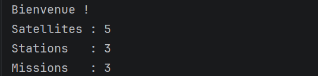

```sql
DECLARE
    v_nb_satellites NUMBER;
    v_nb_stations   NUMBER;
    v_nb_missions   NUMBER;
BEGIN
    SELECT COUNT(*) INTO v_nb_satellites FROM SATELLITE;
    SELECT COUNT(*) INTO v_nb_stations   FROM STATION_SOL;
    SELECT COUNT(*) INTO v_nb_missions   FROM MISSION;
    DBMS_OUTPUT.PUT_LINE('Bienvenue !);
    DBMS_OUTPUT.PUT_LINE('Satellites : ' || v_nb_satellites);
    DBMS_OUTPUT.PUT_LINE('Stations   : ' || v_nb_stations);
    DBMS_OUTPUT.PUT_LINE('Missions   : ' || v_nb_missions);
END;
/
```

### Exercice 2 — SELECT INTO sur un satellite précis

Récupère et affiche les caractéristiques de SAT-001 via un `SELECT INTO`.

**Résultat attendu :**
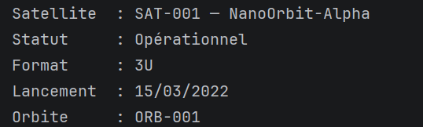


```sql
DECLARE
    v_sat SATELLITE%ROWTYPE;
BEGIN
    SELECT * INTO v_sat
      FROM SATELLITE
     WHERE id_satellite = 'SAT-001';

    DBMS_OUTPUT.PUT_LINE('Satellite  : ' || v_sat.id_satellite || ' — ' || v_sat.nom_satellite);
    DBMS_OUTPUT.PUT_LINE('Statut     : ' || v_sat.statut);
    DBMS_OUTPUT.PUT_LINE('Format     : ' || v_sat.format_cubesat);
    DBMS_OUTPUT.PUT_LINE('Lancement  : ' || TO_CHAR(v_sat.date_lancement, 'DD/MM/YYYY'));
    DBMS_OUTPUT.PUT_LINE('Orbite     : ' || v_sat.id_orbite);
END;
/
```


### Exercice 3 — %ROWTYPE et affichage statut + capacité batterie

Lit une ligne complète de SATELLITE avec `%ROWTYPE` et affiche les informations clés de SAT-003.

**Résultat attendu :**

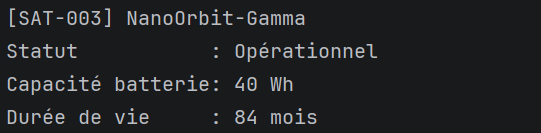


```sql
DECLARE
    v_sat SATELLITE%ROWTYPE;
BEGIN
    SELECT * INTO v_sat
      FROM SATELLITE
     WHERE id_satellite = 'SAT-003';

    DBMS_OUTPUT.PUT_LINE('[' || v_sat.id_satellite || '] ' || v_sat.nom_satellite);
    DBMS_OUTPUT.PUT_LINE('Statut           : ' || v_sat.statut);
    DBMS_OUTPUT.PUT_LINE('Capacité batterie: ' || v_sat.capacite_batterie || ' Wh');
    DBMS_OUTPUT.PUT_LINE('Durée de vie     : ' || v_sat.duree_vie_prevue || ' mois');
END;
/
```

---

### Exercice 4 — NVL sur résolution d'instrument

Affiche la résolution de chaque instrument. Pour `INS-AIS-01`, la résolution est `NULL` (récepteur AIS, pas d'image) → afficher `N/A`.

**Résultat attendu :**

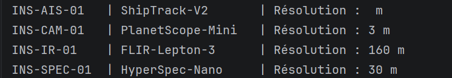


```sql
BEGIN
    FOR rec IN (
        SELECT ref_instrument, modele, resolution
          FROM INSTRUMENT
         ORDER BY ref_instrument
    ) LOOP
        DBMS_OUTPUT.PUT_LINE(
            RPAD(rec.ref_instrument, 12) || ' | '
            || RPAD(rec.modele, 18)      || ' | Résolution : '
            || NVL(TO_CHAR(rec.resolution) || ' m', 'N/A')
        );
    END LOOP;
END;
/
```

---


### Exercice 5 — IF/ELSIF : catégoriser un satellite

Catégorise SAT-004 selon son statut et sa durée de vie restante estimée (calculée à partir de `date_lancement + duree_vie_prevue`).

**Résultat attendu :**

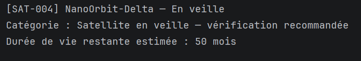


```sql
DECLARE
    v_sat           SATELLITE%ROWTYPE;
    v_fin_vie       DATE;
    v_mois_restants NUMBER;
    v_categorie     VARCHAR2(100);
BEGIN
    SELECT * INTO v_sat FROM SATELLITE WHERE id_satellite = 'SAT-004';

    v_fin_vie       := ADD_MONTHS(v_sat.date_lancement, v_sat.duree_vie_prevue);
    v_mois_restants := ROUND(MONTHS_BETWEEN(v_fin_vie, SYSDATE));

    IF v_sat.statut = 'Désorbité' THEN
        v_categorie := 'Satellite désorbité — hors service';
    ELSIF v_sat.statut = 'En veille' THEN
        v_categorie := 'Satellite en veille — vérification recommandée';
    ELSIF v_mois_restants < 0 THEN
        v_categorie := 'Satellite opérationnel — dépassement de durée de vie nominale';
    ELSIF v_mois_restants < 6 THEN
        v_categorie := 'Satellite opérationnel — fin de vie imminente (< 6 mois)';
    ELSE
        v_categorie := 'Satellite opérationnel — en service nominal';
    END IF;

    DBMS_OUTPUT.PUT_LINE('[' || v_sat.id_satellite || '] ' || v_sat.nom_satellite || ' — ' || v_sat.statut);
    DBMS_OUTPUT.PUT_LINE('Catégorie : ' || v_categorie);
    DBMS_OUTPUT.PUT_LINE('Durée de vie restante estimée : ' || v_mois_restants || ' mois');
END;
/
```

---

### Exercice 6 — CASE : type d'orbite et vitesse orbitale

Affiche le type d'orbite de SAT-001 et calcule sa vitesse orbitale approximative.

**Formule :** `v = 2π × (6371 + altitude) / (période en secondes)`

**Résultat attendu :**

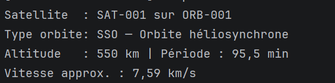


```sql
DECLARE
    v_sat        SATELLITE%ROWTYPE;
    v_orb        ORBITE%ROWTYPE;
    v_type_label VARCHAR2(50);
    v_vitesse    NUMBER;
BEGIN
    SELECT * INTO v_sat FROM SATELLITE WHERE id_satellite = 'SAT-001';
    SELECT * INTO v_orb FROM ORBITE    WHERE id_orbite    = v_sat.id_orbite;

    v_type_label := CASE v_orb.type_orbite
        WHEN 'SSO' THEN 'Orbite héliosynchrone'
        WHEN 'LEO' THEN 'Orbite basse terrestre'
        WHEN 'MEO' THEN 'Orbite moyenne'
        WHEN 'GEO' THEN 'Orbite géostationnaire'
        ELSE 'Type inconnu'
    END;

    -- v = 2π × (6371 + altitude) / (période en secondes)
    v_vitesse := ROUND(2 * 3.14159265 * (6371 + v_orb.altitude) / (v_orb.periode_orbitale * 60), 2);

    DBMS_OUTPUT.PUT_LINE('Satellite  : ' || v_sat.id_satellite || ' sur ' || v_orb.id_orbite);
    DBMS_OUTPUT.PUT_LINE('Type orbite: ' || v_orb.type_orbite || ' — ' || v_type_label);
    DBMS_OUTPUT.PUT_LINE('Altitude   : ' || v_orb.altitude || ' km | Période : ' || v_orb.periode_orbitale || ' min');
    DBMS_OUTPUT.PUT_LINE('Vitesse approx. : ' || v_vitesse || ' km/s');
END;
/
```

---

### Exercice 7 — Boucle FOR : grille des volumes de données

Calcule le volume théorique pour des passages de 5 à 15 minutes avec le débit de `GS-TLS-01` (150 Mbps).

**Formule :** `volume (Mo) = débit (Mbps) × durée (s) / 8`

**Résultat attendu :**

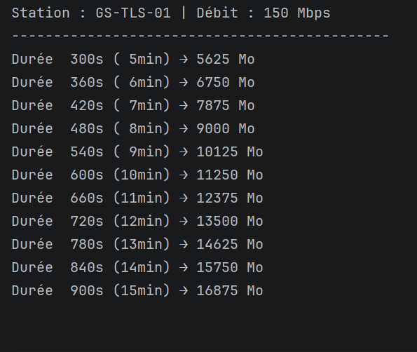


```sql
DECLARE
    v_debit   STATION_SOL.debit_max%TYPE;
    v_station STATION_SOL.code_station%TYPE := 'GS-TLS-01';
    v_volume  NUMBER;
    v_duree   NUMBER;
BEGIN
    SELECT debit_max INTO v_debit FROM STATION_SOL WHERE code_station = v_station;

    DBMS_OUTPUT.PUT_LINE('Station : ' || v_station || ' | Débit : ' || v_debit || ' Mbps');
    DBMS_OUTPUT.PUT_LINE(RPAD('-', 45, '-'));

    FOR i IN 5..15 LOOP
        v_duree  := i * 60;
        v_volume := ROUND(v_debit * v_duree / 8, 1);
        DBMS_OUTPUT.PUT_LINE(
            'Durée ' || LPAD(v_duree, 4) || 's (' || LPAD(i, 2) || 'min)'
            || ' → ' || v_volume || ' Mo'
        );
    END LOOP;
END;
/
```


### Exercice 8 — SQL%ROWCOUNT : mise à jour multiple

Remet tous les satellites `En veille` à `Opérationnel` et affiche le nombre de lignes modifiées. Un `ROLLBACK` final préserve les données.

**Résultat attendu :**

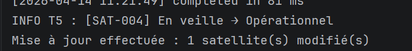


```sql
BEGIN
    UPDATE SATELLITE
       SET statut = 'Opérationnel'
     WHERE statut = 'En veille';

    DBMS_OUTPUT.PUT_LINE('Mise à jour effectuée : ' || SQL%ROWCOUNT || ' satellite(s) modifié(s)');
    ROLLBACK;
END;
/
```

---

### Exercice 9 — Cursor FOR Loop : satellites + orbite + instruments

Liste tous les satellites avec leur orbite et le nombre d'instruments embarqués.

**Résultat attendu :**

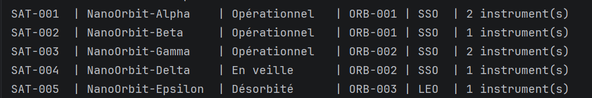


```sql
BEGIN
    FOR rec IN (
        SELECT s.id_satellite,
               s.nom_satellite,
               s.statut,
               o.id_orbite,
               o.type_orbite,
               COUNT(e.ref_instrument) AS nb_instruments
          FROM SATELLITE     s
          JOIN ORBITE         o ON s.id_orbite    = o.id_orbite
          LEFT JOIN EMBARQUEMENT e ON s.id_satellite = e.id_satellite
         GROUP BY s.id_satellite, s.nom_satellite, s.statut,
                  o.id_orbite, o.type_orbite
         ORDER BY s.id_satellite
    ) LOOP
        DBMS_OUTPUT.PUT_LINE(
            RPAD(rec.id_satellite, 8)    || ' | '
            || RPAD(rec.nom_satellite, 18) || ' | '
            || RPAD(rec.statut, 14)        || ' | '
            || rec.id_orbite               || ' | '
            || RPAD(rec.type_orbite, 4)    || ' | '
            || rec.nb_instruments || ' instrument(s)'
        );
    END LOOP;
END;
/
```


### Exercice 10 — Curseur explicite OPEN/FETCH/CLOSE

Liste les satellites opérationnels avec leur dernière fenêtre de communication réalisée (date, station, volume).

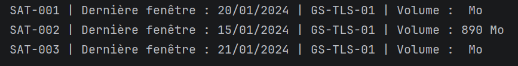


```sql
DECLARE
    CURSOR c_sat_op IS
        SELECT s.id_satellite,
               s.nom_satellite,
               f.datetime_debut,
               f.code_station,
               f.volume_donnees
          FROM SATELLITE s
          JOIN (
              SELECT id_satellite, MAX(datetime_debut) AS derniere_date
                FROM FENETRE_COM
               GROUP BY id_satellite
          ) d ON s.id_satellite = d.id_satellite
          JOIN FENETRE_COM f ON f.id_satellite  = s.id_satellite
                            AND f.datetime_debut = d.derniere_date
         WHERE s.statut = 'Opérationnel'
         ORDER BY s.id_satellite;

    v_rec c_sat_op%ROWTYPE;
BEGIN
    OPEN c_sat_op;
    LOOP
        FETCH c_sat_op INTO v_rec;
        EXIT WHEN c_sat_op%NOTFOUND;
        DBMS_OUTPUT.PUT_LINE(
            v_rec.id_satellite || ' | Dernière fenêtre : '
            || TO_CHAR(v_rec.datetime_debut, 'DD/MM/YYYY')
            || ' | ' || v_rec.code_station
            || ' | Volume : ' || NVL(TO_CHAR(v_rec.volume_donnees) || ' Mo', 'N/A')
        );
    END LOOP;
    CLOSE c_sat_op;
END;
/
```

---

### Exercice 11 — Curseur paramétré : fenêtres d'une station

Affiche toutes les fenêtres de communication de `GS-KIR-01` avec le volume total téléchargé sur les fenêtres réalisées.

**Résultat attendu :**

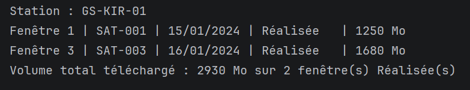


```sql
DECLARE
    CURSOR c_fenetres (p_station VARCHAR2) IS
        SELECT f.id_fenetre,
               f.id_satellite,
               f.datetime_debut,
               f.statut,
               f.volume_donnees
          FROM FENETRE_COM f
         WHERE f.code_station = p_station
         ORDER BY f.datetime_debut;

    v_station      VARCHAR2(15) := 'GS-KIR-01';
    v_volume_total NUMBER       := 0;
    v_nb_realisees NUMBER       := 0;
BEGIN
    DBMS_OUTPUT.PUT_LINE('Station : ' || v_station);
    DBMS_OUTPUT.PUT_LINE(RPAD('-', 60, '-'));

    FOR rec IN c_fenetres(v_station) LOOP
        DBMS_OUTPUT.PUT_LINE(
            'Fenêtre ' || rec.id_fenetre
            || ' | ' || rec.id_satellite
            || ' | ' || TO_CHAR(rec.datetime_debut, 'DD/MM/YYYY')
            || ' | ' || RPAD(rec.statut, 10)
            || ' | ' || NVL(TO_CHAR(rec.volume_donnees) || ' Mo', 'N/A')
        );
        IF rec.statut = 'Réalisée' AND rec.volume_donnees IS NOT NULL THEN
            v_volume_total := v_volume_total + rec.volume_donnees;
            v_nb_realisees := v_nb_realisees + 1;
        END IF;
    END LOOP;

    DBMS_OUTPUT.PUT_LINE(RPAD('-', 60, '-'));
    DBMS_OUTPUT.PUT_LINE('Volume total téléchargé : ' || v_volume_total
        || ' Mo sur ' || v_nb_realisees || ' fenêtre(s) Réalisée(s)');
END;
/
```


### Exercice 12 — Exceptions prédéfinies : SELECT INTO sécurisé

Tente de lire un satellite en gérant `NO_DATA_FOUND` et `OTHERS`.

**Résultat attendu :**

**Test 1**
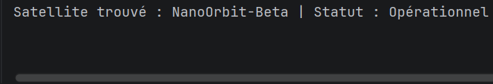

**Test 2**
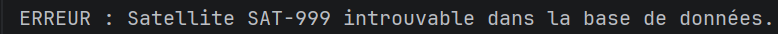


```sql
-- Test 1 — satellite existant
DECLARE
    v_sat SATELLITE%ROWTYPE;
BEGIN
    SELECT * INTO v_sat FROM SATELLITE WHERE id_satellite = 'SAT-002';
    DBMS_OUTPUT.PUT_LINE('Satellite trouvé : ' || v_sat.nom_satellite || ' | Statut : ' || v_sat.statut);
EXCEPTION
    WHEN NO_DATA_FOUND THEN
        DBMS_OUTPUT.PUT_LINE('ERREUR : Satellite introuvable dans la base de données.');
    WHEN OTHERS THEN
        DBMS_OUTPUT.PUT_LINE('ERREUR inattendue : ' || SQLERRM);
END;
/

-- Test 2 — satellite inexistant
DECLARE
    v_sat SATELLITE%ROWTYPE;
BEGIN
    SELECT * INTO v_sat FROM SATELLITE WHERE id_satellite = 'SAT-999';
    DBMS_OUTPUT.PUT_LINE('Satellite trouvé : ' || v_sat.nom_satellite);
EXCEPTION
    WHEN NO_DATA_FOUND THEN
        DBMS_OUTPUT.PUT_LINE('ERREUR : Satellite SAT-999 introuvable dans la base de données.');
    WHEN OTHERS THEN
        DBMS_OUTPUT.PUT_LINE('ERREUR inattendue : ' || SQLERRM);
END;
/
```


### Exercice 13 — RAISE_APPLICATION_ERROR : validation avant INSERT

Valide une fenêtre de communication avant insertion en vérifiant trois règles métier : satellite opérationnel, station active, absence de chevauchement.

**Résultat attendu :**

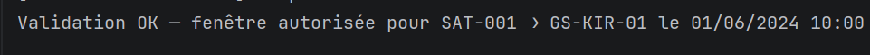


```sql
DECLARE
    v_statut_sat  SATELLITE.statut%TYPE;
    v_statut_sta  STATION_SOL.statut%TYPE;
    v_nb_conflits NUMBER;
    v_id_satellite  VARCHAR2(10) := 'SAT-001';
    v_code_station  VARCHAR2(15) := 'GS-KIR-01';
    v_debut         TIMESTAMP    := TIMESTAMP '2024-06-01 10:00:00';
    v_duree         NUMBER       := 300;
    v_fin           TIMESTAMP;
BEGIN
    v_fin := v_debut + (v_duree / 86400);

    SELECT statut INTO v_statut_sat FROM SATELLITE  WHERE id_satellite = v_id_satellite;
    IF v_statut_sat != 'Opérationnel' THEN
        RAISE_APPLICATION_ERROR(-20401, 'Satellite ' || v_id_satellite || ' non opérationnel (' || v_statut_sat || ')');
    END IF;

    SELECT statut INTO v_statut_sta FROM STATION_SOL WHERE code_station = v_code_station;
    IF v_statut_sta != 'Active' THEN
        RAISE_APPLICATION_ERROR(-20402, 'Station ' || v_code_station || ' non active (' || v_statut_sta || ')');
    END IF;

    SELECT COUNT(*) INTO v_nb_conflits
      FROM FENETRE_COM
     WHERE id_satellite = v_id_satellite
       AND v_debut < (datetime_debut + (duree / 86400))
       AND v_fin   > datetime_debut;

    IF v_nb_conflits > 0 THEN
        RAISE_APPLICATION_ERROR(-20403, 'Chevauchement temporel détecté pour ' || v_id_satellite);
    END IF;

    DBMS_OUTPUT.PUT_LINE('Validation OK — fenêtre autorisée pour '
        || v_id_satellite || ' → ' || v_code_station
        || ' le ' || TO_CHAR(v_debut, 'DD/MM/YYYY HH24:MI'));
EXCEPTION
    WHEN OTHERS THEN
        DBMS_OUTPUT.PUT_LINE('Validation échouée : ' || SQLERRM);
END;
/
```


### Exercice 14 — Procédure : `afficher_statut_satellite`

Affiche le statut, l'orbite et les instruments embarqués d'un satellite identifié par son `id`.

**Paramètre :** `p_id IN` — identifiant du satellite

**Résultat attendu :**


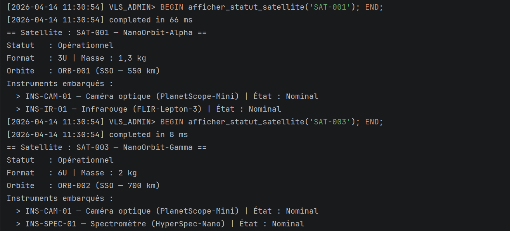


```sql
CREATE OR REPLACE PROCEDURE afficher_statut_satellite (
    p_id IN SATELLITE.id_satellite%TYPE
) AS
    v_sat SATELLITE%ROWTYPE;
    v_orb ORBITE%ROWTYPE;
BEGIN
    SELECT * INTO v_sat FROM SATELLITE WHERE id_satellite = p_id;
    SELECT * INTO v_orb FROM ORBITE    WHERE id_orbite    = v_sat.id_orbite;

    DBMS_OUTPUT.PUT_LINE('== Satellite : ' || v_sat.id_satellite || ' — ' || v_sat.nom_satellite || ' ==');
    DBMS_OUTPUT.PUT_LINE('Statut   : ' || v_sat.statut);
    DBMS_OUTPUT.PUT_LINE('Format   : ' || v_sat.format_cubesat || ' | Masse : ' || v_sat.masse || ' kg');
    DBMS_OUTPUT.PUT_LINE('Orbite   : ' || v_orb.id_orbite
                         || ' (' || v_orb.type_orbite || ' — ' || v_orb.altitude || ' km)');
    DBMS_OUTPUT.PUT_LINE('Instruments embarqués :');

    FOR rec IN (
        SELECT i.ref_instrument, i.type_instrument, i.modele, e.etat_fonctionnement
          FROM EMBARQUEMENT e
          JOIN INSTRUMENT   i ON e.ref_instrument = i.ref_instrument
         WHERE e.id_satellite = p_id
         ORDER BY i.ref_instrument
    ) LOOP
        DBMS_OUTPUT.PUT_LINE('  > ' || rec.ref_instrument
            || ' — ' || rec.type_instrument
            || ' (' || rec.modele || ')'
            || ' | État : ' || rec.etat_fonctionnement);
    END LOOP;
EXCEPTION
    WHEN NO_DATA_FOUND THEN
        DBMS_OUTPUT.PUT_LINE('ERREUR : Satellite ' || p_id || ' introuvable.');
    WHEN OTHERS THEN
        DBMS_OUTPUT.PUT_LINE('ERREUR : ' || SQLERRM);
END afficher_statut_satellite;
/
SHOW ERRORS PROCEDURE afficher_statut_satellite;

-- Tests
BEGIN afficher_statut_satellite('SAT-001'); END;
/
BEGIN afficher_statut_satellite('SAT-003'); END;
/
```

---

### Exercice 15 — Procédure : `mettre_a_jour_statut`

Met à jour le statut d'un satellite et retourne l'ancien statut via un paramètre `OUT`.

**Paramètres :**
- `p_id IN` — identifiant satellite
- `p_statut IN` — nouveau statut
- `p_ancien_statut OUT` — ancien statut avant modification

**Résultat attendu :**

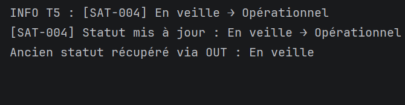


```sql
CREATE OR REPLACE PROCEDURE mettre_a_jour_statut (
    p_id             IN  SATELLITE.id_satellite%TYPE,
    p_statut         IN  SATELLITE.statut%TYPE,
    p_ancien_statut  OUT SATELLITE.statut%TYPE
) AS
BEGIN
    SELECT statut INTO p_ancien_statut
      FROM SATELLITE
     WHERE id_satellite = p_id;

    UPDATE SATELLITE
       SET statut = p_statut
     WHERE id_satellite = p_id;

    DBMS_OUTPUT.PUT_LINE('[' || p_id || '] Statut mis à jour : '
        || p_ancien_statut || ' → ' || p_statut);
EXCEPTION
    WHEN NO_DATA_FOUND THEN
        RAISE_APPLICATION_ERROR(-20501, 'Satellite ' || p_id || ' introuvable.');
    WHEN OTHERS THEN
        RAISE_APPLICATION_ERROR(-20500, 'Erreur mise à jour statut : ' || SQLERRM);
END mettre_a_jour_statut;
/
SHOW ERRORS PROCEDURE mettre_a_jour_statut;

-- Test : SAT-004 En veille → Opérationnel
DECLARE
    v_ancien_statut SATELLITE.statut%TYPE;
BEGIN
    mettre_a_jour_statut('SAT-004', 'Opérationnel', v_ancien_statut);
    DBMS_OUTPUT.PUT_LINE('Ancien statut récupéré via OUT : ' || v_ancien_statut);
    ROLLBACK;
END;
/
```


### Exercice 16 — Fonction : `calculer_volume_session`

Retourne le volume théorique d'une fenêtre de communication en multipliant le débit max de la station par la durée.

**Formule :** `volume (Mo) = débit (Mbps) × durée (s) / 8`

**Paramètre :** `p_id_fenetre IN` — retourne un `NUMBER`

**Résultat attendu :**


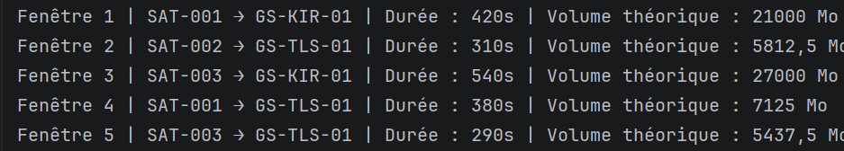


```sql
CREATE OR REPLACE FUNCTION calculer_volume_session (
    p_id_fenetre IN FENETRE_COM.id_fenetre%TYPE
) RETURN NUMBER AS
    v_debit  STATION_SOL.debit_max%TYPE;
    v_duree  FENETRE_COM.duree%TYPE;
BEGIN
    SELECT s.debit_max, f.duree
      INTO v_debit, v_duree
      FROM FENETRE_COM f
      JOIN STATION_SOL s ON f.code_station = s.code_station
     WHERE f.id_fenetre = p_id_fenetre;

    RETURN ROUND(v_debit * v_duree / 8, 2);
EXCEPTION
    WHEN NO_DATA_FOUND THEN
        RAISE_APPLICATION_ERROR(-20601, 'Fenêtre ' || p_id_fenetre || ' introuvable.');
    WHEN OTHERS THEN
        RAISE_APPLICATION_ERROR(-20600, 'Erreur calcul volume : ' || SQLERRM);
END calculer_volume_session;
/
SHOW ERRORS FUNCTION calculer_volume_session;

-- Test sur les 5 fenêtres du jeu de données
BEGIN
    FOR rec IN (
        SELECT id_fenetre, id_satellite, code_station, duree
          FROM FENETRE_COM ORDER BY id_fenetre
    ) LOOP
        DBMS_OUTPUT.PUT_LINE(
            'Fenêtre ' || rec.id_fenetre
            || ' | ' || rec.id_satellite || ' → ' || rec.code_station
            || ' | Durée : ' || rec.duree || 's'
            || ' | Volume théorique : ' || calculer_volume_session(rec.id_fenetre) || ' Mo'
        );
    END LOOP;
END;
/
```


## L3-B Script SPEC pkg_nanoOrbit


```sql
CREATE OR REPLACE PACKAGE pkg_nanoOrbit AS

    -- Type public : statistiques d'un satellite
    TYPE t_stats_satellite IS RECORD (
        nb_fenetres          NUMBER,
        volume_total         NUMBER,
        duree_moy_secondes   NUMBER
    );

    -- Constantes métier
    c_statut_min_fenetre  CONSTANT VARCHAR2(20) := 'Opérationnel'; -- RG-S06
    c_duree_max_fenetre   CONSTANT NUMBER       := 900;            -- RG-F04
    c_seuil_revision      CONSTANT NUMBER       := 50;             -- seuil révision

    -- Procédures
    PROCEDURE planifier_fenetre (
        p_id_satellite    IN  SATELLITE.id_satellite%TYPE,
        p_code_station    IN  STATION_SOL.code_station%TYPE,
        p_datetime_debut  IN  FENETRE_COM.datetime_debut%TYPE,
        p_duree           IN  FENETRE_COM.duree%TYPE,
        p_id_fenetre      OUT FENETRE_COM.id_fenetre%TYPE
    );

    PROCEDURE cloturer_fenetre (
        p_id_fenetre     IN FENETRE_COM.id_fenetre%TYPE,
        p_volume_donnees IN FENETRE_COM.volume_donnees%TYPE
    );

    PROCEDURE affecter_satellite_mission (
        p_id_satellite IN SATELLITE.id_satellite%TYPE,
        p_id_mission   IN MISSION.id_mission%TYPE,
        p_role         IN PARTICIPATION.role_satellite%TYPE
    );

    PROCEDURE mettre_en_revision (
        p_id_satellite IN SATELLITE.id_satellite%TYPE
    );

    -- Fonctions
    FUNCTION calculer_volume_theorique (
        p_id_fenetre IN FENETRE_COM.id_fenetre%TYPE
    ) RETURN NUMBER;

    FUNCTION statut_constellation RETURN VARCHAR2;

    FUNCTION stats_satellite (
        p_id_satellite IN SATELLITE.id_satellite%TYPE
    ) RETURN t_stats_satellite;

END pkg_nanoOrbit;
/
SHOW ERRORS PACKAGE pkg_nanoOrbit;
```

---

### L3-B Script BODY pkg_nanoOrbit

```sql
CREATE OR REPLACE PACKAGE BODY pkg_nanoOrbit AS

    -- planifier_fenetre : INSERT sur FENETRE_COM → déclenche T1 + T2
    PROCEDURE planifier_fenetre (
        p_id_satellite    IN  SATELLITE.id_satellite%TYPE,
        p_code_station    IN  STATION_SOL.code_station%TYPE,
        p_datetime_debut  IN  FENETRE_COM.datetime_debut%TYPE,
        p_duree           IN  FENETRE_COM.duree%TYPE,
        p_id_fenetre      OUT FENETRE_COM.id_fenetre%TYPE
    ) AS
    BEGIN
        IF p_duree < 1 OR p_duree > c_duree_max_fenetre THEN
            RAISE_APPLICATION_ERROR(-20701,
                'Durée invalide. Doit être entre 1 et ' || c_duree_max_fenetre || ' s.');
        END IF;

        INSERT INTO FENETRE_COM (
            datetime_debut, duree, elevation_max, volume_donnees, statut, id_satellite, code_station
        ) VALUES (
            p_datetime_debut, p_duree, 0, NULL, 'Planifiée', p_id_satellite, p_code_station
        ) RETURNING id_fenetre INTO p_id_fenetre;

        DBMS_OUTPUT.PUT_LINE('Fenêtre ' || p_id_fenetre || ' planifiée pour '
            || p_id_satellite || ' → ' || p_code_station);
    EXCEPTION
        WHEN OTHERS THEN
            RAISE_APPLICATION_ERROR(-20700, 'Erreur planification : ' || SQLERRM);
    END planifier_fenetre;


    -- cloturer_fenetre : UPDATE statut → Réalisée + volume → déclenche T3
    PROCEDURE cloturer_fenetre (
        p_id_fenetre     IN FENETRE_COM.id_fenetre%TYPE,
        p_volume_donnees IN FENETRE_COM.volume_donnees%TYPE
    ) AS
        v_statut FENETRE_COM.statut%TYPE;
    BEGIN
        SELECT statut INTO v_statut FROM FENETRE_COM WHERE id_fenetre = p_id_fenetre;

        IF v_statut != 'Planifiée' THEN
            RAISE_APPLICATION_ERROR(-20711,
                'Fenêtre ' || p_id_fenetre || ' ne peut pas être clôturée (statut : ' || v_statut || ')');
        END IF;

        UPDATE FENETRE_COM
           SET statut = 'Réalisée', volume_donnees = p_volume_donnees
         WHERE id_fenetre = p_id_fenetre;

        DBMS_OUTPUT.PUT_LINE('Fenêtre ' || p_id_fenetre || ' clôturée | Volume : '
            || NVL(TO_CHAR(p_volume_donnees) || ' Mo', 'N/A'));
    EXCEPTION
        WHEN NO_DATA_FOUND THEN
            RAISE_APPLICATION_ERROR(-20710, 'Fenêtre ' || p_id_fenetre || ' introuvable.');
        WHEN OTHERS THEN RAISE;
    END cloturer_fenetre;


    -- affecter_satellite_mission : INSERT PARTICIPATION → déclenche T4
    PROCEDURE affecter_satellite_mission (
        p_id_satellite IN SATELLITE.id_satellite%TYPE,
        p_id_mission   IN MISSION.id_mission%TYPE,
        p_role         IN PARTICIPATION.role_satellite%TYPE
    ) AS
        v_count NUMBER;
    BEGIN
        SELECT COUNT(*) INTO v_count FROM PARTICIPATION
         WHERE id_satellite = p_id_satellite AND id_mission = p_id_mission;

        IF v_count > 0 THEN
            RAISE_APPLICATION_ERROR(-20721,
                p_id_satellite || ' participe déjà à ' || p_id_mission);
        END IF;

        INSERT INTO PARTICIPATION (id_satellite, id_mission, role_satellite)
        VALUES (p_id_satellite, p_id_mission, p_role);

        DBMS_OUTPUT.PUT_LINE(p_id_satellite || ' affecté à ' || p_id_mission
            || ' | Rôle : ' || p_role);
    EXCEPTION
        WHEN OTHERS THEN
            RAISE_APPLICATION_ERROR(-20720, 'Erreur affectation : ' || SQLERRM);
    END affecter_satellite_mission;


    -- mettre_en_revision : UPDATE statut → En veille → déclenche T5
    PROCEDURE mettre_en_revision (
        p_id_satellite IN SATELLITE.id_satellite%TYPE
    ) AS
        v_statut SATELLITE.statut%TYPE;
    BEGIN
        SELECT statut INTO v_statut FROM SATELLITE WHERE id_satellite = p_id_satellite;

        IF v_statut = 'Désorbité' THEN
            RAISE_APPLICATION_ERROR(-20731, 'Un satellite désorbité ne peut pas être mis en révision.');
        END IF;
        IF v_statut = 'En veille' THEN
            DBMS_OUTPUT.PUT_LINE('INFO : ' || p_id_satellite || ' est déjà en veille.'); RETURN;
        END IF;

        UPDATE SATELLITE SET statut = 'En veille' WHERE id_satellite = p_id_satellite;
        DBMS_OUTPUT.PUT_LINE(p_id_satellite || ' mis en veille pour révision.');
    EXCEPTION
        WHEN NO_DATA_FOUND THEN
            RAISE_APPLICATION_ERROR(-20730, 'Satellite ' || p_id_satellite || ' introuvable.');
        WHEN OTHERS THEN RAISE;
    END mettre_en_revision;


    -- calculer_volume_theorique : débit × durée / 8
    FUNCTION calculer_volume_theorique (
        p_id_fenetre IN FENETRE_COM.id_fenetre%TYPE
    ) RETURN NUMBER AS
        v_debit STATION_SOL.debit_max%TYPE;
        v_duree FENETRE_COM.duree%TYPE;
    BEGIN
        SELECT s.debit_max, f.duree INTO v_debit, v_duree
          FROM FENETRE_COM f JOIN STATION_SOL s ON f.code_station = s.code_station
         WHERE f.id_fenetre = p_id_fenetre;
        RETURN ROUND(v_debit * v_duree / 8, 2);
    EXCEPTION
        WHEN NO_DATA_FOUND THEN
            RAISE_APPLICATION_ERROR(-20801, 'Fenêtre ' || p_id_fenetre || ' introuvable.');
    END calculer_volume_theorique;


    -- statut_constellation : résumé textuel global
    FUNCTION statut_constellation RETURN VARCHAR2 AS
        v_total NUMBER; v_op NUMBER; v_act NUMBER;
    BEGIN
        SELECT COUNT(*) INTO v_total FROM SATELLITE;
        SELECT COUNT(*) INTO v_op    FROM SATELLITE WHERE statut        = 'Opérationnel';
        SELECT COUNT(*) INTO v_act   FROM MISSION   WHERE statut_mission = 'Active';
        RETURN v_op || '/' || v_total || ' satellites opérationnels, ' || v_act || ' mission(s) active(s)';
    END statut_constellation;


    -- stats_satellite : nb fenêtres, volume total, durée moyenne
    FUNCTION stats_satellite (
        p_id_satellite IN SATELLITE.id_satellite%TYPE
    ) RETURN t_stats_satellite AS
        v_stats  t_stats_satellite;
        v_exists NUMBER;
    BEGIN
        SELECT COUNT(*) INTO v_exists FROM SATELLITE WHERE id_satellite = p_id_satellite;
        IF v_exists = 0 THEN
            RAISE_APPLICATION_ERROR(-20901, 'Satellite ' || p_id_satellite || ' introuvable.');
        END IF;

        SELECT COUNT(*), NVL(SUM(volume_donnees), 0), NVL(ROUND(AVG(duree), 1), 0)
          INTO v_stats.nb_fenetres, v_stats.volume_total, v_stats.duree_moy_secondes
          FROM FENETRE_COM WHERE id_satellite = p_id_satellite;

        RETURN v_stats;
    END stats_satellite;

END pkg_nanoOrbit;
/
SHOW ERRORS PACKAGE BODY pkg_nanoOrbit;
```


### L3-D Script de validation

Enchaîne les 7 sous-programmes dans un scénario réaliste. Un `ROLLBACK` final annule toutes les modifications de test.


```sql
DECLARE
    v_id_fenetre FENETRE_COM.id_fenetre%TYPE;
    v_stats      pkg_nanoOrbit.t_stats_satellite;
    v_resume     VARCHAR2(200);
BEGIN
    DBMS_OUTPUT.PUT_LINE(RPAD('=', 65, '='));
    DBMS_OUTPUT.PUT_LINE('   SCENARIO DE VALIDATION — pkg_nanoOrbit');
    DBMS_OUTPUT.PUT_LINE(RPAD('=', 65, '='));

    -- Etape 1 : planifier une fenêtre SAT-001 → GS-KIR-01
    DBMS_OUTPUT.PUT_LINE(CHR(10) || '>>> ETAPE 1 : planifier_fenetre');
    pkg_nanoOrbit.planifier_fenetre('SAT-001', 'GS-KIR-01',
        TIMESTAMP '2024-06-15 08:00:00', 350, v_id_fenetre);
    DBMS_OUTPUT.PUT_LINE('    → Fenêtre créée avec id_fenetre = ' || v_id_fenetre);

    -- Etape 2 : clôturer la fenêtre avec 1100 Mo
    DBMS_OUTPUT.PUT_LINE(CHR(10) || '>>> ETAPE 2 : cloturer_fenetre');
    pkg_nanoOrbit.cloturer_fenetre(v_id_fenetre, 1100);
    DBMS_OUTPUT.PUT_LINE('    → Fenêtre ' || v_id_fenetre || ' clôturée avec 1100 Mo');

    -- Etape 3 : affecter SAT-004 à MSN-ARC-2023
    DBMS_OUTPUT.PUT_LINE(CHR(10) || '>>> ETAPE 3 : affecter_satellite_mission');
    pkg_nanoOrbit.affecter_satellite_mission('SAT-004', 'MSN-ARC-2023', 'Satellite de relais');
    DBMS_OUTPUT.PUT_LINE('    → SAT-004 affecté à MSN-ARC-2023');

    -- Etape 4 : mettre SAT-002 en révision
    DBMS_OUTPUT.PUT_LINE(CHR(10) || '>>> ETAPE 4 : mettre_en_revision');
    pkg_nanoOrbit.mettre_en_revision('SAT-002');
    DBMS_OUTPUT.PUT_LINE('    → SAT-002 mis en révision (En veille)');

    -- Etape 5 : volume théorique fenêtre 1
    DBMS_OUTPUT.PUT_LINE(CHR(10) || '>>> ETAPE 5 : calculer_volume_theorique');
    DBMS_OUTPUT.PUT_LINE('    → Volume théorique fenêtre 1 : '
        || pkg_nanoOrbit.calculer_volume_theorique(1) || ' Mo');

    -- Etape 6 : stats SAT-001
    DBMS_OUTPUT.PUT_LINE(CHR(10) || '>>> ETAPE 6 : stats_satellite(SAT-001)');
    v_stats := pkg_nanoOrbit.stats_satellite('SAT-001');
    DBMS_OUTPUT.PUT_LINE('    → Nb fenêtres      : ' || v_stats.nb_fenetres);
    DBMS_OUTPUT.PUT_LINE('    → Volume total     : ' || v_stats.volume_total || ' Mo');
    DBMS_OUTPUT.PUT_LINE('    → Durée moyenne    : ' || v_stats.duree_moy_secondes || ' s');

    -- Etape 7 : résumé constellation
    DBMS_OUTPUT.PUT_LINE(CHR(10) || '>>> ETAPE 7 : statut_constellation');
    v_resume := pkg_nanoOrbit.statut_constellation();
    DBMS_OUTPUT.PUT_LINE('    → ' || v_resume);

    DBMS_OUTPUT.PUT_LINE(CHR(10) || RPAD('=', 65, '='));
    DBMS_OUTPUT.PUT_LINE('   SCENARIO TERMINE — ROLLBACK');
    DBMS_OUTPUT.PUT_LINE(RPAD('=', 65, '='));
    ROLLBACK;

EXCEPTION
    WHEN OTHERS THEN
        DBMS_OUTPUT.PUT_LINE('ERREUR SCENARIO : ' || SQLERRM);
        ROLLBACK;
END;
/
```
